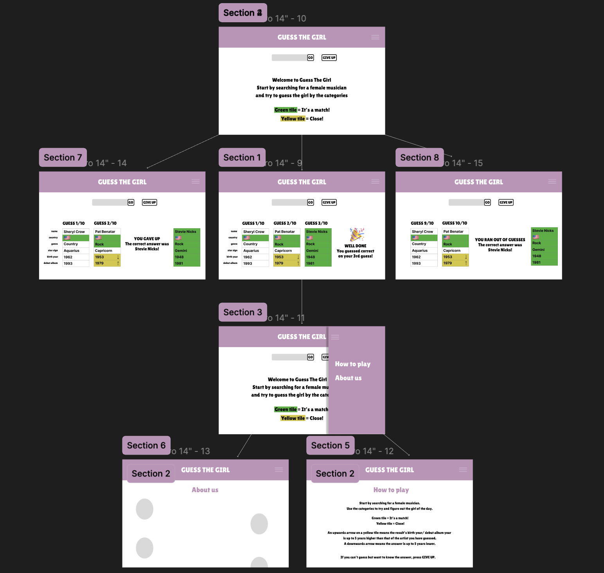
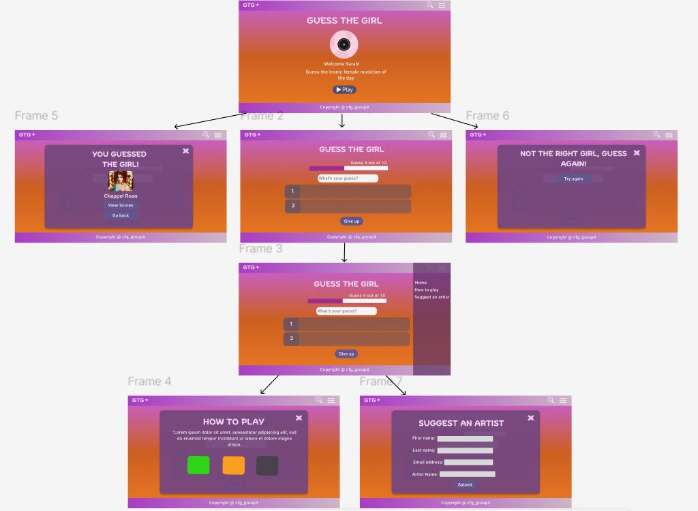
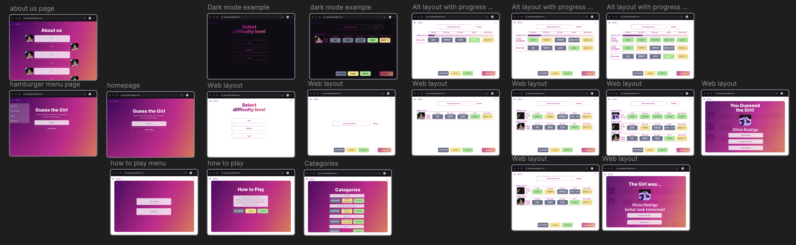
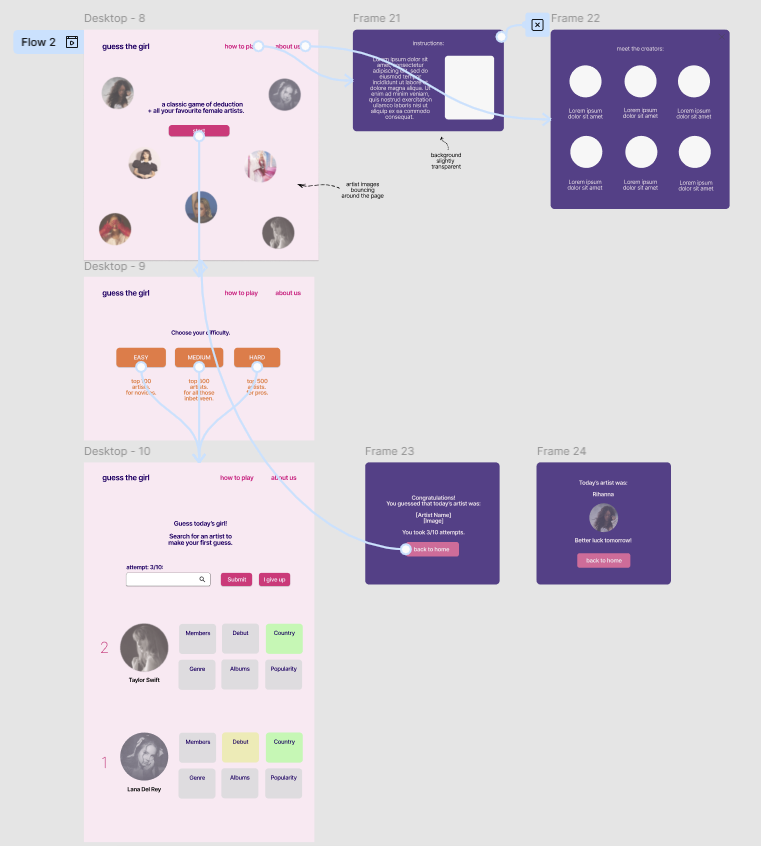
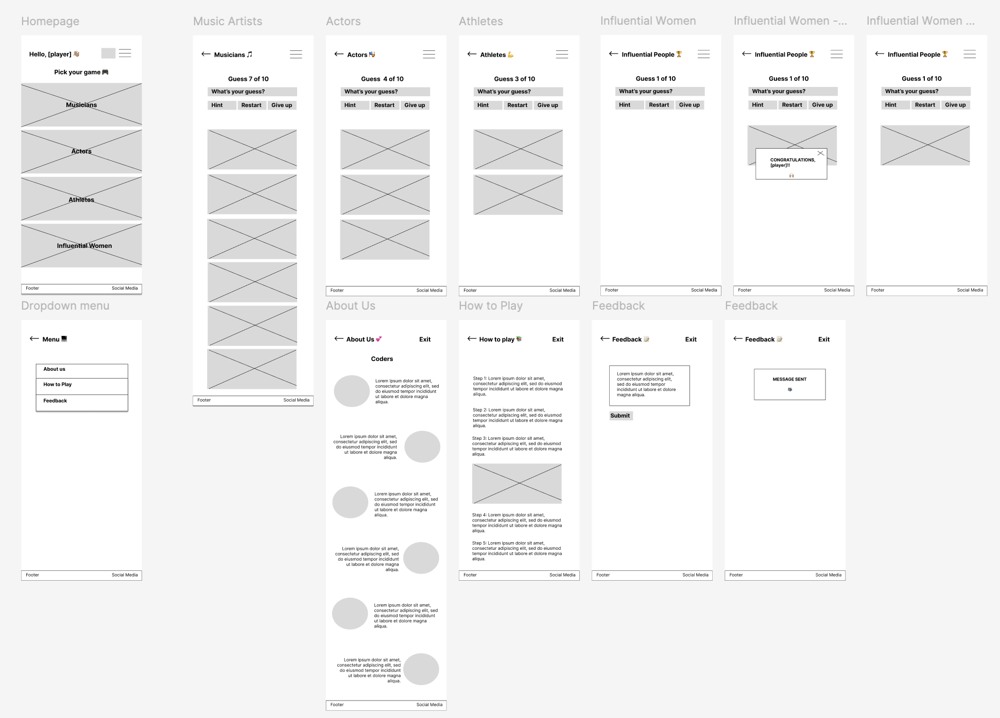
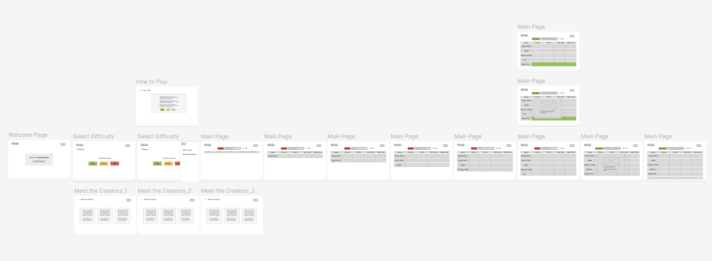

# Wireframes

This folder contains screenshots of wireframes that we have all created individually. They include key features we have discussed in our group meetings. Below is our list of project priorities and maybes. Some wireframes demonstrate these extra features such as the 'About us' page and progress bar. 

Our next step is to create a final collaboratve wireframe including prioritised features. If time allows, we will consider adding extra features down the line. We will also use the final wireframe to decide on style (colours, fonts etc).

### Project Priorities

#### Priorities:
- Guess a woman within 10 guesses
- One category – musicians (initially at least)
- The give up button
- Different levels of difficulties e.g. ‘Easy - top 100’.
- How to play - pop up

#### Maybe's:
- Leaderboard/winner board
- If daily add streak
- Navigation bar
- Progress bar to display how many turns the user has left
- About us page
- Footer
- Feedback function?
- Accessibility - colours etc. 
- Mobile app
- Hints - a blurred photo of the answer? Or a random fact about the person (could be used post game as well when person gets the answer/gives up)
- Timer feature
- Restart function to allow player to repeat the game
- Share button
- User review/testimonials 

[Figma-wireframe-version1](https://www.figma.com/design/XzV3xibhm7kNMsxS1kssTi/CFG-group-4-wireframe?node-id=0-1&t=MLgkJZa6ecmixBF3-1)

[Figma-wireframe-version2](https://www.figma.com/design/XzV3xibhm7kNMsxS1kssTi/CFG-group-4-wireframe?node-id=2014-2&t=MLgkJZa6ecmixBF3-1)
